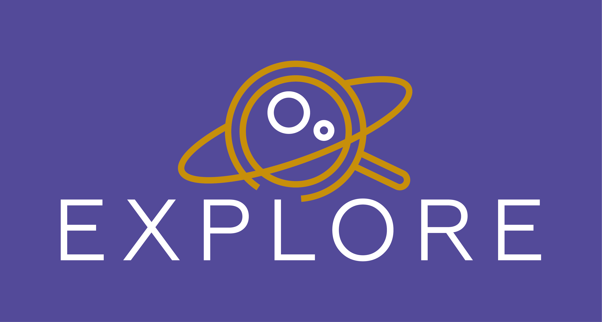

# Contributing to X

Thank you for your interest in contributing to the **X** &#8480; application!

The **X** tool aims to ...

This documents is a set of guidelines for contributing to the **X** code on GitHub. These are guidelines, not rules. 
This guide is meant to make it easy for you to get involved!

* [Participation guidelines](#participation-guidelines)
* [What we're working on](#what-were-working-on)
* [How to submit changes](#how-to-submit-changes)
* [How to report bugs](#how-to-report-bugs)
* [Communication channels](#communication-channels)

## Participation guidelines

This project adheres to a [code of conduct](CODE_OF_CONDUCT.md). By participating, you are expected to uphold this code. Please report unacceptable behavior to contact@explore-platform.eu.

## What we're working on

Take a look at the milestones in our [roadmap](ROADMAP.md) or browse the [issues](https://gitlab.acri-cwa.fr/project-explore/templates/template/-/issues) to get started!

## How can I contribute

### Suggesting enhancements

Enhancement suggestions are tracked as GitHub issues. After you've determined which repository your enhancement suggestion is related to, create an issue on that repository and provide the information detailed information.

### Contributions 

#### License in = license out (option 1)

Contributions from community participants are accepted using the same inbound OSI-approved open source license as the project uses to distribute the resulting work. No CLA (contributor license agreement) is required. 

#### Developer Certificate of Origin (option 2)

EXPLORE adopts the Developer Certificate of Origin ([DCO](https://wiki.linuxfoundation.org/dco)) to facilitate contributions from the community. 
The Developer Certificate of Origin (DCO) is a lightweight way for contributors to certify that they wrote or otherwise have the right to submit the code they are contributing to the project. Here is the full text of the DCO, reformatted for readability: https://developercertificate.org/

We use the [DCO app](https://github.com/apps/dco) to enforce the DCO on Pull Requests.
It requires all commit messages to contain the Signed-off-by line with an email address that matches the commit author.

#### Contributor License Agreement (CLA) (option 3)

If you want to contribute code (or anything else that might be subject to copyright) to our repository we ask you to sign a Contributor License Agreement (CLA), like many other open source projects. By signing it, you explicitely allow us to use your contribution - the purpose of this process is to have agreed terms for that, and to avoid any misunderstandings.

Signing the CLA is pretty straightforward and does not involve any paperwork - we’re using [CLA Assistant](https://cla-assistant.io/) by SAP SE for it, which means that you can simply sign with few clicks right out of GitHub.

As soon as you create a pull request to be merged into our **greenshot*** repository (or add a commit to an existing pull request), a comment will ask you to sign the CLA. Click the link, carefully read the document and then sign it by clicking the button. That’s it.
CLA Assistant will not ask you again to sign the CLA unless we apply changes to the agreement.

If you want to learn more about license agreements, you might want to have a look at 
[contributoragreements.org](http://contributoragreements.org/). 
The website also offers a license agreement chooser, which we have used to generate EXPLORE's Contributor License Agreement.

## How to submit changes

Once you've identified one of the issues above that you feel you can contribute to, you're ready to make a change to the project repository!
 
1. **[Fork](https://help.github.com/articles/fork-a-repo/) this repository**. This makes your own version of this project you can edit and use.
2. **[Make your changes](https://guides.github.com/activities/forking/#making-changes)**! You can do this in the GitHub interface on your own local machine. Once you're happy with your changes...
3. **Submit a [pull request](https://help.github.com/articles/proposing-changes-to-a-project-with-pull-requests/)**. This opens a discussion around your project and lets the project lead know you are proposing changes.

First time contributing to open source? Check out the free series [How to Contribute to an Open Source Project on GitHub](https://egghead.io/series/how-to-contribute-to-an-open-source-project-on-github).

## How to report bugs

Notice a mistake? Please file any bugs, requests, or questions in our [issue tracker](https://gitlab.acri-cwa.fr/project-explore/templates/template/-/issues)!

## Communication channels

If you want to report a problem or make a suggestion, the easiest thing to do is to [open an issue](../../issues) within this GitHub repository (here is a handy guide for [mastering issues](https://guides.github.com/features/issues/)).

## Copyright 

The EXPLORE **X** scientific data application (App) Authors and Contributors. 
The code in this repository is available under the Apache 2.0 license.

## Service mark (Trademark for services)

The following service marks are part of the Horizon 2020 EXPLORE project:

- EXPLORE &#8480;
- G-Tomo &#8480;
- G-Arch &#8480;
- S-Disco &#8480;
- S-Phot &#8480;
- L-Explo &#8480;
- L-Hex &#8480;

Trademarks are adjectives that alter nouns. The latter refer to the generic name of a product or service. Thus, trademarks are not nouns and may therefore not be used as a generic term. Proper use of these trademarks reinforces their role as brands.
The first time a trademark is used, and as reasonable after that, it should be followed by the common generic (the dictionary name) term of the product. E.g. the EXPLORE&#8480; platform allows to deploy the G-Arch&#8480; scientific data application.

## Acknowledgements

This project has received funding from the European Union’s Horizon 2020 research and innovation programme under grant agreement No 101004214.   

 
